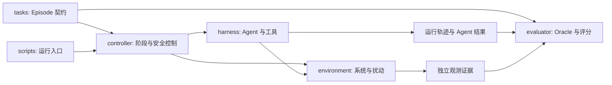

# Resilience Benchmark

面向 AI Agent 的端到端韧性测试 Benchmark 仓库。项目将题目、被测环境、Agent 接入、运行时控制、独立评价和批量运行拆分为可独立演进的模块。

> 当前状态：环境准备配置与最小安全/判定工具已实现；正式锁定 Episode、远端 Harness/MCP 部署和实验结果尚未完成。

当前真实环境进度与阻塞项见 [`ENVIRONMENT_STATUS.md`](ENVIRONMENT_STATUS.md)。

## 核心目标

Benchmark 不仅判断 Agent 是否成功执行一条故障命令，而是评估它能否在安全约束和有限实验预算下，完成“选择实验 → 执行实验 → 分析证据”的闭环，并识别、验证和定位真实的系统韧性问题。

一次有效的 Episode 至少需要同时具备：固定的系统快照、可重复的工作负载、Agent 可见证据、受约束的动作空间、实验预算、对 Agent 隐藏的因果真值、独立 Oracle 以及可验证的恢复条件。

## 仓库结构

```text
resiliencebenchmark/
├── benchmarkfactory.yaml # 根级模块清单与准备门槛
├── tasks/          # 题目、Episode 定义与 Ground Truth 契约
├── environment/    # 被测系统、观测数据与环境重置
├── harness/        # Agent 接入、工具接口与运行记录
├── controller/     # 阶段控制、安全门禁、运行时扰动与兜底清理
├── evaluator/      # 独立 Oracle、指标、评分与结果验证
└── scripts/        # 初始化、单次运行与批量评测入口
```

### 模块边界

| 模块 | 负责的核心对象 | 不应承担的职责 |
| --- | --- | --- |
| `tasks/` | Episode 输入、约束、预期输出和隐藏因果真值 | 直接操作运行环境 |
| `environment/` | 系统生命周期、负载、可观测数据和重置 | Agent 策略和评分规则 |
| `harness/` | 模型适配、工具调用、权限边界和完整轨迹 | 代替 Oracle 判定成功 |
| `controller/` | 阶段状态机、预算、安全门禁、扰动和超时清理 | 使用 Agent 的自证作为最终结论 |
| `evaluator/` | 故障生效、SLO 违反、因果机制、诊断和恢复判定 | 向 Agent 泄露 Ground Truth |
| `scripts/` | 组装并调用各模块 | 承载不可复用的核心业务逻辑 |

`controller/` 是运行时控制面：它根据 Episode 约束推进阶段，在执行前完成安全检查，在执行中管理扰动、停止条件和实验预算，并在 Agent 失联或超时时仍能触发独立清理。这一边界使得“被测 Agent 的能力”与“Benchmark 自身的安全性”可以分开验证。

## 预期执行链路



建议的 Episode 生命周期为：

```text
prepare → qualify → baseline → plan → execute/observe
        → recover → evaluate → cleanup
```

安全失败、超过预算或命中停止条件时，控制器应直接转入 `cleanup`，而不是继续尝试获取更高分数。

## Ground Truth 与公开仓库

`tasks/` 保留 Ground Truth 的数据契约，但正式评测中的隐藏因果真值不应直接放在 Agent 可读的公开路径。公开仓库可提供 schema、示例 Episode 和已解锁样例；隐藏测试的 Ground Truth 应由评测服务或受控制的私有数据包交给 `evaluator/`。

## 开始使用

```bash
git clone https://github.com/Myzmzz/resiliencebenchmark.git
cd resiliencebenchmark
find . -maxdepth 2 -type f | sort
```

环境准备阶段可以执行静态验证、dry-run 和显式 kubeconfig 的只读集群资格检查；在 `benchmarkfactory.yaml` 的故障执行门槛全部通过前，不应执行真实故障注入。

```bash
python3 scripts/benchmark_prepare.py validate-repo --repo .
python3 -m pytest
python3 scripts/benchmark_prepare.py dry-run --repo .
python3 scripts/probe_models.py --models-config harness/models.yaml --dry-run
```

Source snapshots are materialized from immutable public locks and verified by commit plus archive SHA-256:

```bash
make materialize-sources SOURCE_DESTINATION=/runtime/source-root
make verify-sources SOURCE_DESTINATION=/runtime/source-root
```

Sock Shop is rendered from a pinned archived manifest. Its images can be mirrored to Harbor without persisting registry credentials:

```bash
make render-sock-shop
make mirror-sock-shop-dry
```

## 下一阶段

1. 使用轮换后的 Harbor Robot Account 完成 Sock Shop digest 镜像同步并恢复 14 个 Deployment。
2. 授权部署 SSH 公钥，在目标主机运行固定版本的 DeepSeek Harness 安装脚本并执行 headless 资格检查。
3. 部署并验证 Prometheus、Jaeger、Loki、Kubernetes、source 和 chaos-control MCP 的实际端点。
4. 轮换模型网关凭据后执行七模型 capability probe，冻结可比较的 Harness × Model 单元。
5. 对历史 ChaosBlade 资源完成所有权确认和数据面残留核对，然后解锁首批 6–10 个 Episode。
